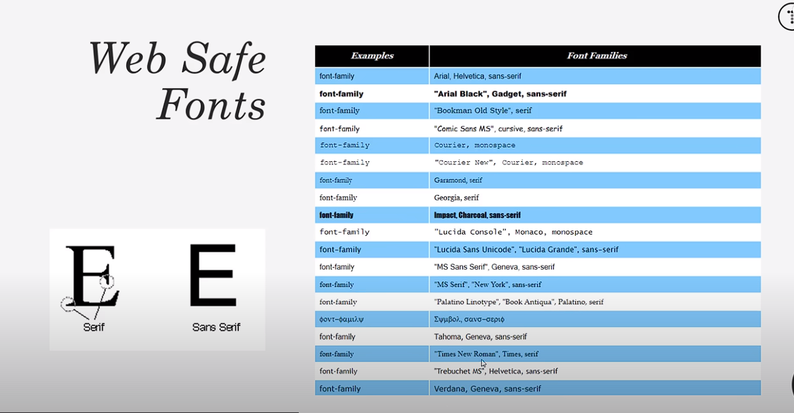
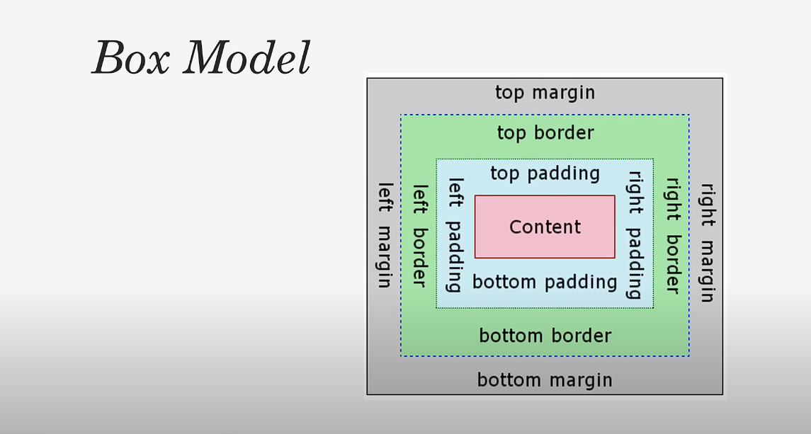
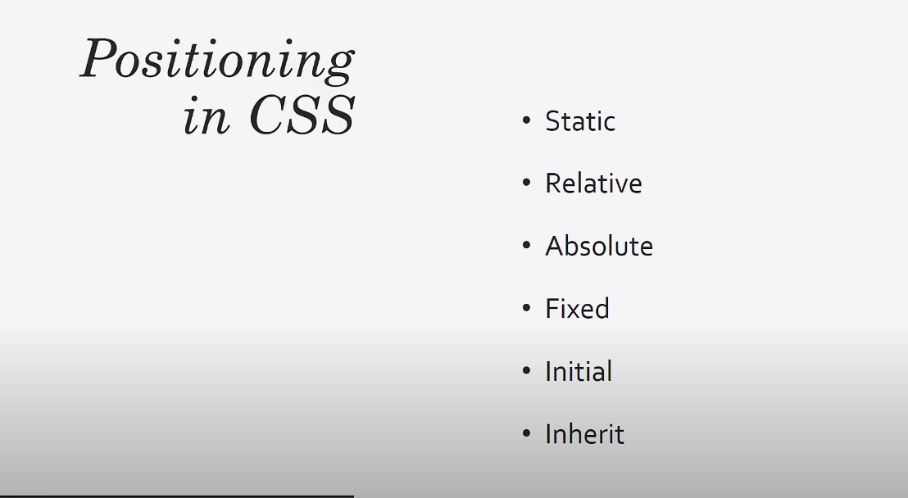

# CSS CRASH COURSE

## Web Fonts Safe



```css
body{
    background-color: #f4f4f4;
    color: #555;

    font-family: Arial, Helvetica, sans-serif;
    font-size: 16px;
    font-weight: normal;
    /* Same as above */
    font: normal 16px Arial, Helvetica, sans-serif;

    /* space between the lines */
    line-height: 1.6em;

}

.container{
    width: 80%;
    margin: auto;
}

.box-1{
    background-color: #333;
    color: #FFF;
}

```

## Box Model



```css
    /*  border top -> right-> bot ->left */
    border-top: 5px solid red;
    border-right: 5px solid red;
    border-bottom: 5px solid red;
    border-left: 5px solid red;

    /* Same as above */
    border: 5px solid red;

    /* padding */
    padding-top: 20px;
    padding-top: 20px;
    padding-top: 20px;
    padding-top: 20px;

    /* Same as above */
    padding: 20px;
```

## Text formatting

```css
.box-1 h1{
    font-family: 'Segoe UI', Tahoma, Geneva, Verdana, sans-serif;
    font-weight: 800;
    font-style: italic;
    text-decoration: underline;
    text-transform: uppercase;
    letter-spacing: 0.2em;
    word-spacing: 1em;
}

```

## State of links
```css
a{
    text-decoration: none;
    color: #000;
}

a:hover{
    color: red;
}

a:active{
    color: green;
}

a:visited{
    color: yellow;
}

```

## Styling Lists

```css
.categories{
    border: 1px #ccc solid;
    border-radius: 15px;
    padding: 10px;
}

.categories h2{
    text-align: center;
}

.categories ul{
    padding: 0;
    list-style: none;
}

.categories li{
    padding-bottom: 6px;
    border-bottom: 1px #fff dotted;
    /* list image url */
    list-style-image: none;
}
```

## Positioning in CSS




