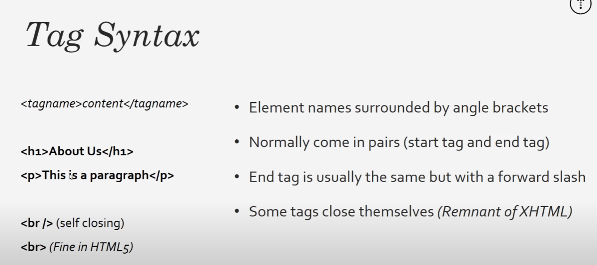
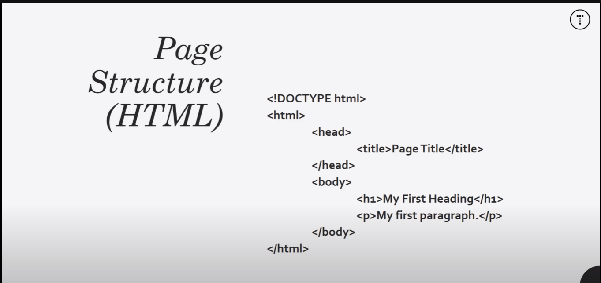
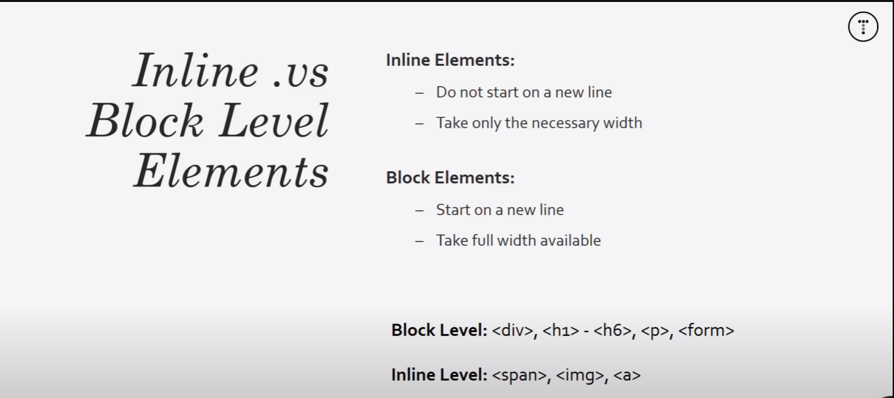
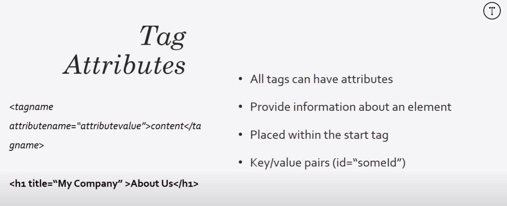
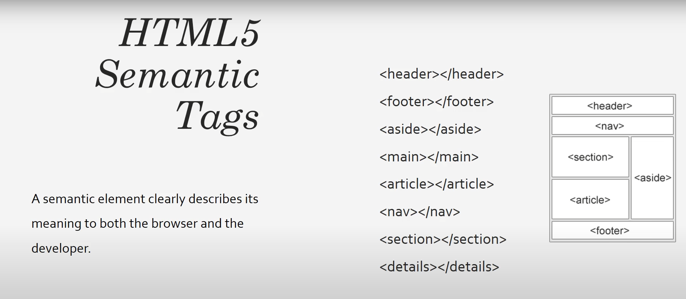

# HTML CRASH COURSE

## Tag syntax


## Page structure


```html
<!DOCTYPE html>
<html lang="en">
<head>
    <meta charset="UTF-8">
    <meta name="viewport" content="width=device-width, initial-scale=1.0">
    <title>HTML Cheat Sheet</title>
</head>
<body>
    <!-- Headings -->
    <h1>Heading 1</h1>
    <h2>heading 2</h2>
    <h3>Heading 3</h3>
    <h4>Heading 4</h4>
    <h5>Heading 5</h5>
    <h6>Heading 6</h6>

    <!-- Paragraph -->
    <p>
        Lorem ipsum dolor sit amet, consectetur adipisicing elit. Quidem esse quod culpa quam dolore <em>possimus, odio consequatur harum provident veniam! Eum distinctio assumenda eius. Illum dolore</em> excepturi deserunt quas obcaecati.
    </p>

    <p>
        Lorem ipsum ,<strong>dolor sit amet consectetur</strong>, adipisicing elit. Commodi consequuntur praesentium, corrupti dicta, debitis delectus aliquam magnam modi nobis ipsum impedit, ut vitae. Quo dolor placeat tenetur quae veritatis amet.
    </p>
</body>
</html>
```

`User Agent StyleSheet` is the default browser style.

## Inline vs Block-level Elements



`<em> ` semantic tag for bold
`<strong>` semantic tag for empathized

<a href="somewhere" target="_blank">

## Tag Attributes



## Lists  
### Unordered Lists
```html
    <ul>
        <li>List item 1</li>
        <li>List item 2</li>
        <li>List item 3</li>
        <li>List item 4</li>
    </ul>
```
### Ordered Lists
```html
     <ol>
        <li>List item 1</li>
        <li>List item 2</li>
        <li>List item 3</li>
        <li>List item 4</li>
    </ol>
```

## Tables
```html

    <table>
        <thead> <!-- Table Head -->
            <tr> <!-- Table Row-->
                <th>name</th> <!-- element of the header row-->
                <th>email</th>
                <th>age</th>
            </tr>

        </thead>
        <tbody> <!-- Table Body -->
            <tr> <!-- T Row -->
                <td>Data 1</td> <!-- Table Data -->
                <td>Data 2</td>
                <td>Data 3</td>
            </tr>

            <tr>
                <td>Data 1 1</td>
                <td>Data 1 2</td>
                <td>Data 1 3</td>
            </tr>
        </tbody>
    </table>

```

## Forms

```html
<!-- 
        Methods
        POST request to a server;
        GET retrieve data from server;

        Action
        Perform a specific action to the URL;
 -->

    <form action="process.php" method="post"> 
        <div>
            <label for="first-name">FirstName</label>
            <input type="text" name="first-name" placeholder="something placeholder">
        </div>
        <div>
            <label for="last-name">LastName</label>
            <input type="text" name="last-name">
        </div>
        <div>
            <label for="email">EMail: </label>
            <input type="email" name="email">
        </div>
        <div>
            <label for="message">Message: </label>
            <textarea name="message" id="" cols="30" rows="10"></textarea>
        </div>
        <div>
            <label for="gender">Gender: </label>
            <select name="gender" id="">
                <option value="male">male</option>
                <option value="female">male</option>
                <option value="female">other</option>
            </select>
        </div>
        <div>
            <label for="age">Age:</label>
            <input type="number" name="age" value="default value">
        </div>

        <dir>
            <label for="birthday">Bday:</label>
            <input type="date" name="birthday">
        </dir>
        <input type="submit" name="submit" value="Submit">
    </form>

```

## Buttons

```html
    <button>Click Me!</button>
```


## Images
```html
<a href="ss/someWhere">

</a>
```

## Quotations
```html
<blockquote cite="http://google.com">
    Lorem ipsum dolor sit amet consectetur adipisicing elit. Reiciendis error beatae iste, iusto voluptas laudantium nesciunt vel architecto, aliquid quos ea? Beatae excepturi sit rem nulla nam facilis quidem porro?
</blockquote>
```

## Semantic Tags


```html
<!DOCTYPE html>
<html lang="en">
<head>
    <meta charset="UTF-8">
    <meta name="viewport" content="width=device-width, initial-scale=1.0">
    <title>HTML Semantics - Blog Crash Course</title>
</head>
<body>
    <header id="main-header">
        <h1>My Website</h1>
    </header>

    <section>
    <!-- Main area of the page -->
        <article>
            <h3>Blog Post one</h3>
            <small>Posted by Tony today</small>
            <p>Lorem ipsum dolor sit, amet consectetur adipisicing elit. Ratione odit dicta, nihil, officiis obcaecati eos consequatur ducimus magni perspiciatis libero asperiores? Consequuntur libero ea iste accusamus impedit ipsa molestias fugit!</p>
            <a href="post.html">Read more..</a>
        </article>
        
        <article>
            <h3>Blog Post two</h3>
            <small>Posted by Tony today</small>
            <p>Lorem ipsum dolor sit, amet consectetur adipisicing elit. Ratione odit dicta, nihil, officiis obcaecati eos consequatur ducimus magni perspiciatis libero asperiores? Consequuntur libero ea iste accusamus impedit ipsa molestias fugit!</p>
            <a href="post.html">Read more..</a>
        </article>
        
        <article>
            <h3>Blog Post one</h3>
            <small>Posted by Tony today</small>
            <p>Lorem ipsum dolor sit, amet consectetur adipisicing elit. Ratione odit dicta, nihil, officiis obcaecati eos consequatur ducimus magni perspiciatis libero asperiores? Consequuntur libero ea iste accusamus impedit ipsa molestias fugit!</p>
            <a href="post.html">Read more..</a>
        </article>
        
        <article>
            <h3>Blog Post one</h3>
            <small>Posted by Tony today</small>
            <p>Lorem ipsum dolor sit, amet consectetur adipisicing elit. Ratione odit dicta, nihil, officiis obcaecati eos consequatur ducimus magni perspiciatis libero asperiores? Consequuntur libero ea iste accusamus impedit ipsa molestias fugit!</p>
            <a href="post.html">Read more..</a>
        </article>
    
    </section>

    <aside>
        <h3>Categories</h3>
        <nav>
            <ul>
                <li><a href="#">Category 1</a></li>
                <li><a href="#">Category 2</a></li>
                <li><a href="#">Category 3</a></li>
            </ul>
        </nav>
    </aside>

    <footer id="main-footer">
        <p>Copyright &copy; 2023</p>
    </footer>
</body>
</html>
```
