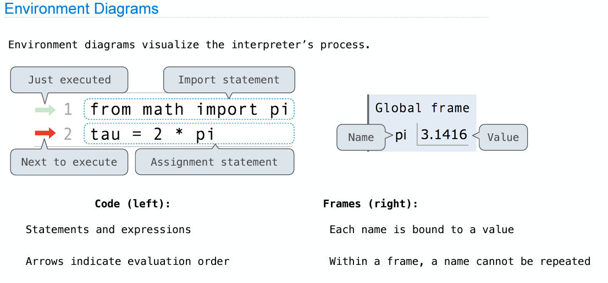
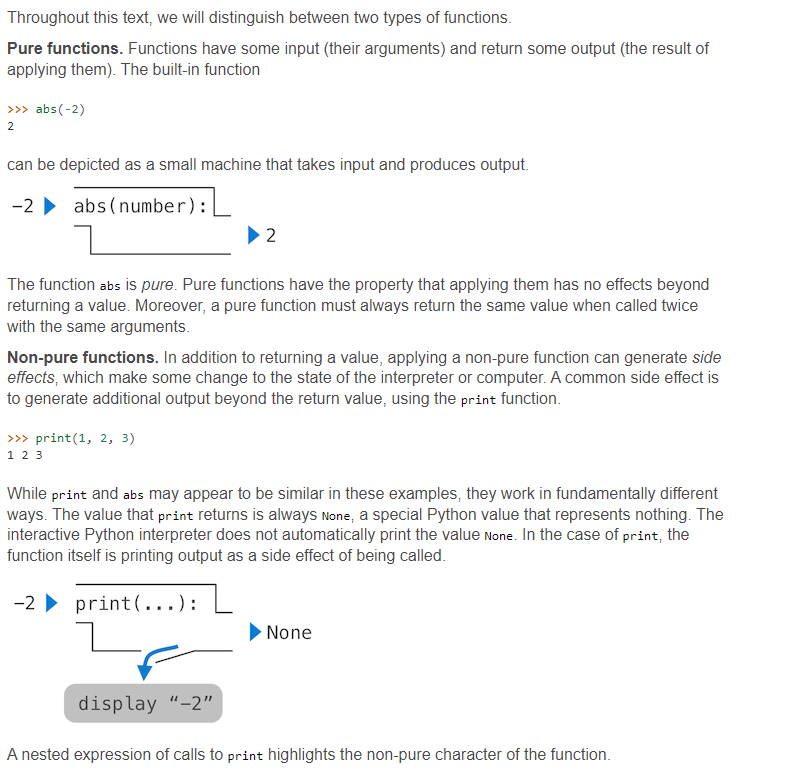
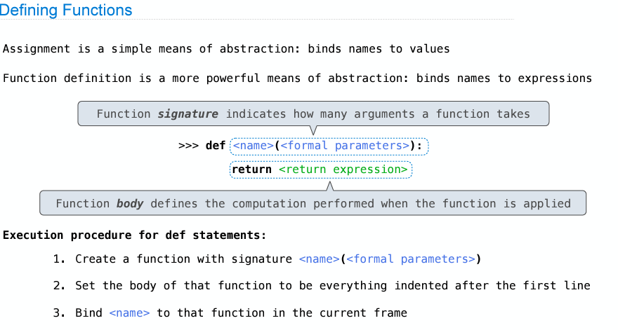
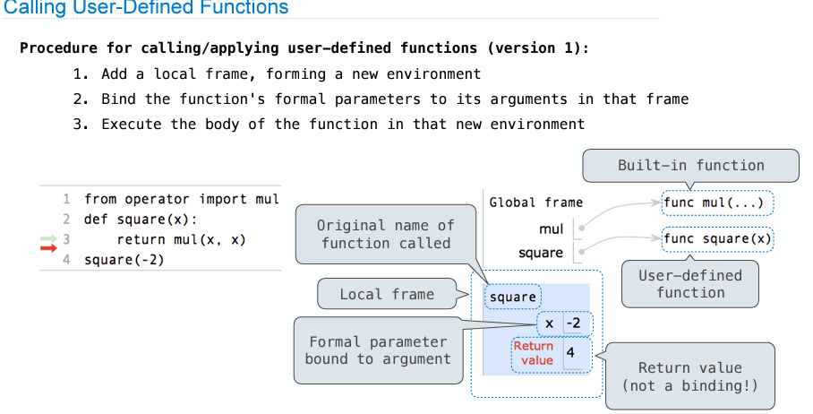
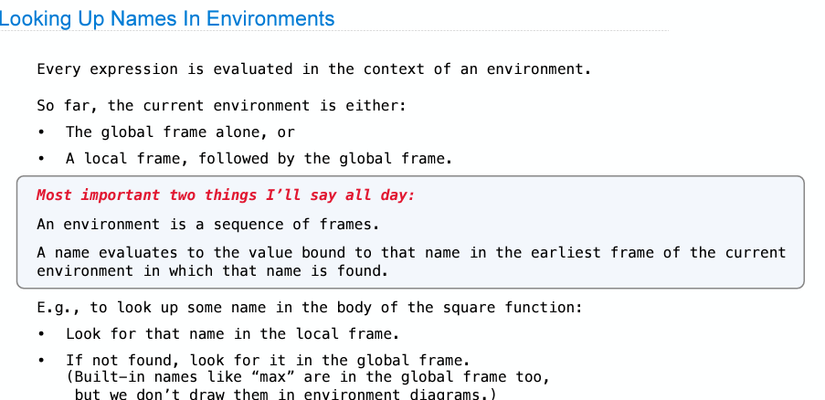

<h1>Module 2. Names</h1>
<p>|__________________________________________|</p>

<h2>_WHAT'S THE MATTER IN THIS SECTION?_</h2>

[](http://www.composingprograms.com/pages/12-elements-of-programming.html)

<p>|_____________________________________________________________________|</p>
<p>|____________________________________|</p>

<ul>
    <li><a href="#u1">1. Primitive expressions</a></li>
    <li><a href="#u2">2. Call expressions</a></li>
    <li><a href="#u3">3. Q1</a></li>
    <li><a href="#u4">4. Code of lecture</a></li>
    <li><a href="#u5">5. Enviroment Diagram</a></li>
    <li><a href="#u6">6. Difference between pure functions and non-pure functions</a></li>
    <li><a href="#u7">7. Defining Functions</a></li>
    <li><a href="#u8">8. User Defining Functions</a></li>
    <li><a href="#u9">9. RESUME REMEMBER</a></li>
</ul>


<h2 id="u1">1. Primitive expressions</h2>


<p id="goUP"></p>


 **Number** `2`

 **Name** `add`

 **String** `'Hello'`


---
<h2 id="u1">2. Call expressions</h2>

`max (2,     3)`

`max(min(2,3), min(2,4)`
 
operands can also be an expression

<h2 id="u3">3. Q1</h2>

```python
>>> f = min
>>> f = max
>>> g = min
>>> h = max
>>> max = g
>>> max(f(2,g(h(1,5),3)), 4)

f = max 
g = min
h = max
max = min

h(1,5) # 5
g(h(1,5),3) => g(5,3) # 3
f(2,g(h(1,5),3)) => f(2,3) # 3
max(f(2,g(h(1,5),3)), 4) => max(3, 4) # 3

print('Result= ', max(f(2,g(h(1,5),3)), 4)) # 3
```

<h2 id="u4">4. Code of lecture</h2>

```python
from math import pi
print(pi * 71 / 223)

from math import sin
print(sin) # built-in function sin
other_sin = sin  # redefine the names of functions, but they point to the exact same functions
print(other_sin) # built-in function sin

# Assignment
radius = 10
print("2 * rad = ", 2 * radius)

area_of = pi * radius
print("area = ", area_of)

circ = 2 * pi * radius
print("circ = ", circ)

radius = 20

# Function values
print(max) # built-in function min , look UP
print(max(2, 3)) # 2

f = max
print(f) # built-in function min
print(f(3,4)) # 3

max = 7 # going back to a numeric value 7
print(f(1, max)) # 7

f = 2 # going back to a numeric value 2
# print(f(3,4)) # f is not callable

print(__builtins__.max)

# User-defined functions
from operator import add, mul

def square(x):
    return mul(x, x)

print("square(5)= ", square(5))
print("(square(add(5,2))= ", square(add(5,2)))

def sum_squares(x, y):
    return add(square(x), square(y))

print("sum_squares(3, 4)= ",sum_squares(3, 4))
print("sum_squares(12, 3)= ",sum_squares(12, 3))


# area function
def area():
    return pi*radius*radius

area()
radius = 20
area()
radius = 20
area()
```
---

<h2 id="u5">5. Enviroment Diagram</h2>



---

<h2 id="u6">6. Difference between pure functions and non-pure functions</h2>

*Pure functions. Functions have some input (their arguments) and return some output (the result of applying them). The built-in function*
**abs functions**

> `abs(-2)`

---

*Non-pure functions. In addition to returning a value, applying a non-pure function can generate side effects, which make some change to the state of the interpreter or computer. A common side effect is to generate additional output beyond the return value, using the print function,*
**print functions**

`print('something')`

---

---

<h2 id="u7">7. Defining Functions</h2>

---

***Assignment** is a simple means of abstraction: **binds names to values**.*

***Function definition** is a more powerful means of abstraction: binds **names to expressions***




<h2 id="u8">8. User Defining Functions</h2>
---

> watch the diagram



<h2 id="u9">9. RESUME REMEMBER</h2>

> **READ IT**




