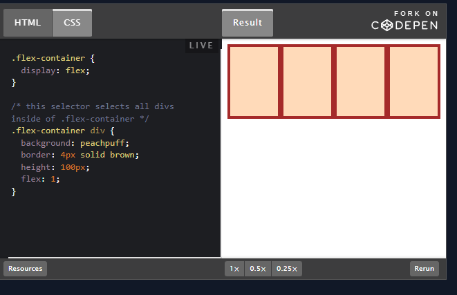

# CSS Fundamentals

[CSS values and units MDN](https://developer.mozilla.org/en-US/docs/Learn/CSS/Building_blocks/Values_and_units)  
[video material](https://scrimba.com/scrim/co12d4cf99cf2776f19e84a9d)  
[]()

### Basic Syntax

*At the most basic level, ``CSS`` is made up of various rules. These rules are made up of a ``selector`` (more on this in a bit) and a semi-colon separated list of declarations, with each of those declarations being made up of a property:value pair.*


#### Note!
*A `<div>` is one of the basic HTML elements. It is simply an empty container. In general, it is best to use other tags such as ``<h1>`` or ``<p>`` for content in your projects, but as we learn more about CSS you’ll find that there are many cases where the thing you need is just a container for other elements. Many of our exercises use plain``<div>``s for simplicity. Later lessons will go into much more depth about when it is appropriate to use the various HTML elements.*

## Selectors

*``Selectors`` simply refer to the HTML elements to which CSS rules apply; they’re what is actually being ``“selected”`` for each rule. The following subsections don’t cover every selector available, but they’re by far the most common and the ones you should get comfortable using first.*

### Universal selector

*The ``universal`` selector will select elements of any type, hence the name “universal”, and the syntax for it is a simple asterisk. In the example below, every element would have the `color: purple;` style applied to it.*`
`
```css
* {
  color: purple;
}
```

### Type selector

*A ``type selector`` (or element selector) will select ``all elements`` of the given element type, and the syntax is just the name of the element:*

```html
<!-- index.html -->

<div>Hello, World!</div>
<div>Hello again!</div>
<p>Hi...</p>
<div>Okay, bye.</div>
```

```css
/* styles.css */

div {
  color: white;
}
```

*Here, all three`` <div>`` elements would be selected, while the`` <p>`` element wouldn’t be.*

### Class selectors
*``Class selectors`` will select all elements with the given class, which is just an attribute you place on an HTML element. Here’s how you add a class to an HTML tag and select it in CSS:*

```html
<!-- index.html -->

<div class="alert-text">Please agree to our terms of service.</div>
```

```css
/* styles.css */

.alert-text {
  color: red;
}
```

*Another thing you can do with the class attribute is to add multiple classes to a single element as a space-separated list, such as ``class="alert-text severe-alert"``.*

### ID selector

*ID selectors are similar to class selectors. They select an element with the given ID, which is another attribute you place on an HTML element. The major difference between classes and IDs is that an element can only have one ID. It cannot be repeated on a single page and should not contain any whitespace:*

```html
<!-- index.html -->

<div id="title">My Awesome 90's Page</div>
```

```css
/* styles.css */

#title {
  background-color: red;
}
```

*For IDs, instead of a period, we use a hashtag immediately followed by the case-sensitive value of the ID attribute. A common pitfall is people overusing the ID attribute when they don’t necessarily need to, and when classes will suffice. While there are cases where using an ID makes sense or is needed, such as taking advantage of specificity or having links redirect to a section on the current page, you should use IDs sparingly (if at all).*

### The grouping selector

```css
.read {
  color: white;
  background-color: black;
  /* several unique declarations */
}

.unread {
  color: white;
  background-color: black;
  /* several unique declarations */
}
```

*Both our ``.read`` and ``.unread`` selectors share the ``color: white;`` and ``background-color: black;`` declarations, but otherwise have several of their own unique declarations. To cut down on the repetition, we can group these two selectors together as a comma-separated list:*

```css
.read,
.unread {
  color: white;
  background-color: black;
}

.read {
  /* several unique declarations */
}

.unread {
  /* several unique declarations */
}
```

### Chaining selectors

*What ``.subsection.header`` does is it selects any element that has both the subsection and header classes. Notice how there isn’t any space between the ``.subsection`` and`` .header`` class selectors. This syntax basically works for chaining any combination of selectors, except for chaining more than one type selector.*

```css
.subsection.header {
  color: red;
}

.subsection#preview {
  color: blue;
}
```

## Properties to get started with

*There are some CSS properties that you’re going to be using all the time, or at the very least more often than not. We’re going to introduce you to several of these properties, though this is by no means a complete list. Learning the following properties will simply be enough to help get you started.*

### Color and background-color
*The ``color`` property sets an element’s text color, while ``background-color`` sets, well, the background color of an element. I guess we’re done here?

Almost. Both of these properties can accept one of several kinds of values. A common one is a keyword, such as an actual color name like red or the transparent keyword. They also accept ``HEX``, ``RGB``, and ``HSL`` values, which you may be familiar with if you’ve ever used a photoshop program or a site where you could customize your profile colors.*

```css
p {
  /* hex example: */
  color: #1100ff;
}

p {
  /* rgb example: */
  color: rgb(100, 0, 127);
}

p {
  /* hsl example: */
  color: hsl(15, 82%, 56%);
}
```

### Typography basics and text-align

#### font-family
*``font-family`` can be a single value or a comma-separated list of values that determine what font an element uses. Each font will fall into one of two categories, either a “font family name” like "``Times New Roman``" (we use quotes due to the whitespace between words) or a “generic family name” like ``sans-serif`` (generic family names never use quotes).

If a browser cannot find or does not support the first font in a list, it will use the next one, then the next one and so on until it finds a supported and valid font. This is why it’s best practice to include a list of values for this property, starting with the font you want to be used most and ending with a generic font family as a fallback, e.g. ``font-family: "Times New Roman", sans-serif;``*

#### font-size
*``font-size`` will, as the property name suggests, set the size of the font. When giving a value to this property, the value should not contain any whitespace, e.g. ``font-size: 22px`` has no space between “22” and “px”.*

#### font-weight
*``font-weight`` affects the boldness of text, assuming the font supports the specified weight. This value can be a keyword, e.g. ``font-weight: bold``, or a number between 1 and 1000, e.g. ``font-weight: 700`` (the equivalent of bold). Usually, the numeric values will be in increments of 100 up to 900, though this will depend on the font.*

#### text-align
*``text-align`` will align text horizontally within an element, and you can use the common keywords you may have come across in word processors as the value for this property, e.g. ``text-align: center``.*

### Image height and width

*Images aren’t the only elements that we can adjust the height and width on, but we want to focus on them specifically in this case.

By default, an ```` element’s ``height`` and ``width`` values will be the same as the actual image file’s height and width. If you wanted to adjust the size of the image without causing it to lose its proportions, you would use a value of “auto” for the ``height`` property and adjust the ``width`` value:*

```css
img {
  height: auto;
  width: 500px;
}
```


## Adding CSS to HTML

*``External CSS`` is the most common method you will come across, and it involves creating a separate file for the CSS and linking it inside of an HTML’s opening and closing ``<head>`` tags with a self-closing ``<link>`` element:*

```html
<!-- index.html -->

<head>
  <link rel="stylesheet" href="styles.css" />
</head>
```

```css
/* styles.css */

div {
  color: white;
  background-color: black;
}

p {
  color: red;
}
```

## Assignment

[1 CSS Method ](https://github.com/TheOdinProject/css-exercises/tree/main/foundations/01-css-methods)


## The Cascade

[The CSS Cascade is a great, interactive read that goes a little more in detail about other factors that affect what CSS rules actually end up being applied](https://2019.wattenberger.com/blog/css-cascade#importance)  

[Changing the Font Family describes a few different approaches to using custom fonts.](https://www.digitalocean.com/community/tutorials/how-to-load-and-use-custom-fonts-with-css#finding-and-loading-a-font-file-from-a-hosted-service)

[CSS Specificity Explained from Kevin Powell goes through various specificity examples and gives some advice on avoiding wrestling with specificity.](https://www.youtube.com/watch?v=c0kfcP_nD9E&ab_channel=KevinPowell)

[MDN references](https://developer.mozilla.org/en-US/docs/Web/CSS/Reference#index)


*Sometimes we may have rules that conflict with one another, and we end up with some unexpected results. “But I wanted these paragraphs to be blue, why are they red like these other paragraphs?!” As frustrating as this can be, it’s important to understand that CSS doesn’t just do things against our wishes. CSS only does what we tell it to do. One exception to this is the default styles that are provided by a browser. These default styles vary from browser to browser, and they are why some elements create a large “gap” between themselves and other elements, or why buttons look the way they do, despite us not writing any CSS rules to style them that way.*

*So if you end up with some unexpected behavior like this it’s either because of these default styles, not understanding how a property works, or not understanding this little thing called the cascade.*

*The cascade is what determines which rules actually get applied to our HTML. There are different factors that the cascade uses to determine this. We will examine three of these factors, which will hopefully help you avoid those frustrating “I hate CSS” moments.*


### Specificity

``ID selectors`` (most specific selector)  
``Class selectors``  
``Type selectors``  

*``Specificity`` will only be taken into account when an element has multiple, conflicting declarations targeting it, sort of like a tie-breaker. An ID selector will always beat any number of class selectors, a class selector will always beat any number of type selectors, and a type selector will always beat any number of anything less specific than it. When no declaration has a selector with a higher ``specificity``, a larger amount of a single selector will beat a smaller amount of that same selector.*

```html
<!-- index.html -->

<div class="main">
  <div class="list subsection"></div>
</div>
```

```css
/* rule 1 */
.subsection {
  color: blue;
}

/* rule 2 */
.main .list {
  color: red;
```

*In the example above, both rules are using only class selectors, but ``rule 2 is more specific`` because it is using more class selectors, so the color: red; declaration would take precedence.

Now, let’s change things a little bit:*

```html
<!-- index.html -->

<div class="main">
  <div class="list" id="subsection"></div>
</div>
```

```css
/* rule 1 */
#subsection {
  color: blue;
}

/* rule 2 */
.main .list {
  color: red;
}
```

*Here because it's an ID, will take out the specify*

### Inheritance

*Inheritance refers to certain CSS properties that, when applied to an element, are inherited by that element’s descendants, even if we don’t explicitly write a rule for those descendants. Typography based properties (``color``, ``font-size``, ``font-family``, etc.) are usually inherited, while most other properties aren’t.*

```html
<!-- index.html -->

<div id="parent">
  <div class="child"></div>
</div
```

```css
/* styles.css */

#parent {
  color: red;
}

.child {
  color: blue;
}
```

*Despite the ``parent`` element having a higher specificity with an ID, the ``child`` element would have the ``color: blue`` style applied since that declaration directly targets it, while`` color: red`` from the parent is only inherited.*


## [The BOX MODEL](https://www.theodinproject.com/lessons/foundations-the-box-model)
### LINKS

[8 MIN YOUTUBE VIDEO](https://www.youtube.com/watch?v=rIO5326FgPE)  


[What is the difference between the standard and alternative box model?](https://developer.mozilla.org/en-US/docs/Learn/CSS/Building_blocks/The_box_model#the_alternative_css_box_model)

[CSS TRICKS](https://css-tricks.com/almanac/properties/m/margin/)

*Every single thing on a webpage is a `rectangular box`. These boxes can have other boxes in them and can sit alongside one another. You can get a rough idea of how this works by sticking a border on every item on the page like this:*

```css
* {
  border: 2px solid red;
}
```


*The only real complication here is that there are many ways to manipulate the size of these boxes, and the space between them, using `padding`, `margin`, and `border`. The assigned articles go into more depth on this concept, but to sum it up briefly:*

`padding` increases the space between the border of a box and the content of the box.  
`margin` increases the space between the borders of a box and the borders of adjacent boxes.  
`border` adds space (even if it’s only a pixel or two) between the margin and the padding.  


# [Block and Inline](https://www.theodinproject.com/lessons/foundations-block-and-inline)

### Block elements
*Most of the elements that you have learned about so far are block elements. In other words, their default style is display: block. By `default`, block elements will appear on the page stacked atop each other, each new element starting on a new line.*

### Inline elements

*`Inline` elements, however, do not start on a new line. They appear in line with whatever elements they are placed beside. A clear example of an inline element is a link, or `<a>` tag. If you stick one of these in the middle of a paragraph of text, it will behave like a part of the paragraph. *

# [FLEXBOX](https://www.theodinproject.com/lessons/foundations-introduction-to-flexbox)

[FLEX TURORIAL](https://internetingishard.netlify.app/html-and-css/flexbox/index.html)

**`Flexbox` is a way to arrange items into rows or columns.**

```html
<div class="flex-container">
  <div class="one"></div>
  <div class="two"></div>
  <div class="three"></div>
  <div class="four"></div>
</div>
```

```css
.flex-container {
  display:flex;
}

.flex-container div {
  background-color: purple;
  border: 4px solid red;
  width: 1.5em;
  flex: 1;
}
```

*All 3 divs should now be arranged horizontally. If you resize the results frame with the “1x”, “.5x” and “.25x” buttons you’ll also see that the divs will ‘flex’. They will fill the available area and will each have equal width.*

### See the live example here


## Flex containers and flex items

*As you’ve seen, `flexbox` is not just a single CSS property but a whole toolbox of properties that you can use to put things where you need them. Some of these properties belong on the `flex container`, while some go on the `flex items`. This is a simple yet important concept.*

**A `flex container` is any element that has `display: flex` on it. A `flex item` is any element that lives directly inside of a `flex container`.**


**Somewhat confusingly, any element can be both a flex container and a flex item. Said another way, you can also put `display: flex` on a flex item and then use flexbox to arrange its children.**


*Creating and nesting multiple flex containers and items is the primary way we will be building up complex layouts.*


## EXERCISES
```HTML
<!-- Menu container -->
    <div class="menu-container">
        <div class="menu">
            <div class="date">Sep 18, 2023</div>
                <div class="links">
                    <div class="signup">Sign Up</div>
                    <div class="login">Login</div>
                </div>
        </div>
    </div>

<!--HEADER-->
    <div class="header-container">
        <div class="header">
            <div class="subscribe">Subscribe &#9662;</div>
            <div class="logo">
                
            </div>
            <div class="social">
                
            </div>
        </div>
    </div>

<!--PHOTOS-->
        <div class="photo-grid-container">
            <div class="photo-grid">
                <div class="photo-grid-item first-item">
                    
                </div>
                <div class="photo-grid-item">
                    
                </div>
                <div class="photo-grid-item">
                    
                </div>
                <div class="photo-grid-item">
                    
                </div><div class="photo-grid-item">
                    
                </div>
            </div>
        </div>

<!--FOOTER-->
        <div class="footer">
            <div class="footer-item footer-one"></div>
            <div class="footer-item footer-two"></div>
            <div class="footer-item footer-three"></div>
        </div>
```

```css

/*borderbox*/
* {
 margin: 0;
 padding: 0;
 box-sizing: border-box;
}

/*MENU*/
.menu-container {
    color: #fff;
    background-color: #5995DA;
    padding: 20px 0;
    display: flex; /* flex container */
    justify-content: center;
}

.menu{
    border: 1px solid #fff;  /* for debug */
    width: 900px;
    display: flex;
    justify-content: space-between;
}

.links{
    display: flex;
    /* border: 1px solid #fff;  */
    justify-content: flex-end;

}

/* HEADER */

.header-container {
    color:#5995DA;
    background-color: #D6E9FE;
    display: flex;
    justify-content: center;
}

.header {
    width: 900px;
    height: 300px;
    display: flex;
    justify-content: space-between; /* <- ->*/
    align-items: center; /* ^  v */
}

/* PHOTO */
.photo-grid-container{
    display: flex;
    justify-content: center;
}

.photo-grid{
    width: 900px;
    display: flex;
    justify-content: center; /* <- -> */
    flex-wrap: wrap; /*Display Wrap*/
    align-items: center; /* ^ v */
    flex-direction: row-reverse;
}

.photo-grid-item{
    width: 300px;
    height: 300px;
    border: 1px solid #fff;
}

/* FOOTER */
.footer{
    display: flex;
    justify-content: space-between;
}

.footer-item{
    border:1px solid #fff;
    background-color: #D6E9FE;
    height: 100px;
    flex: 1;
}

.footer-two{
    flex:2;
}

.footer-one,
.footer-three{
    background-color: #5995DA;
    flex: initial;
    width: 300px;
}
```