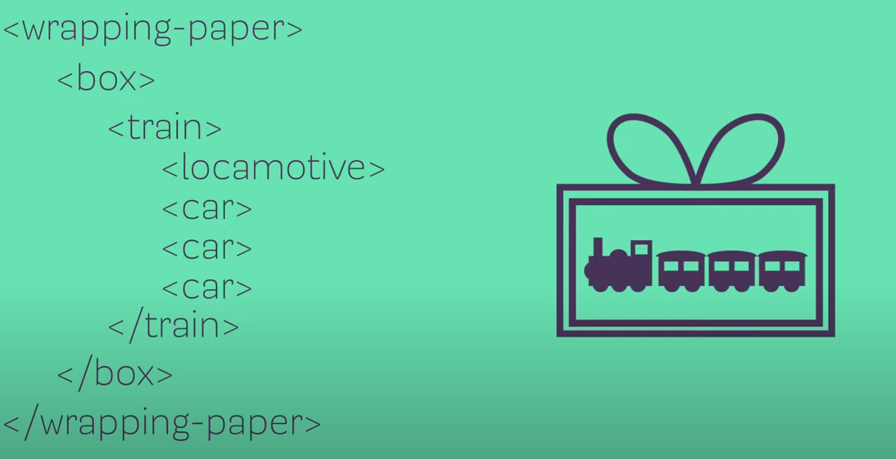

# HTML Fundamentals

[HTML/CSS/JS Difs](https://brytdesigns.com/html-css-javascript-whats-the-difference)  
[MDN element references](https://developer.mozilla.org/en-US/docs/Web/HTML/Element)  
[DEVDOCS REF](https://devdocs.io/)

## HTML
*`HTML` (`HyperText Markup Language`) defines the structure and content of webpages. We use HTML elements to create all of the paragraphs, headings, lists, images, and links that make up a typical webpage. In this lesson, we will explore how HTML elements work.*

### Main differences


### Elements and tags


**You can think of elements as containers for content.**  
*Almost all elements on an HTML page are just pieces of content wrapped in opening and closing HTML tags.*

```html
<p> Content here </p>
```

## HTML Boilerplate

*All `HTML` documents have the same basic structure or boilerplate that needs to be in place before anything useful can be done. In this lesson, we will explore the different parts of this boilerplate and see how it all fits together.*

### Creating an HTML file

```bash
mkdir html-boilerplate
touch index.html
```

*We should always name the `HTML` file that will contain the homepage of our websites index.html. This is because web servers will by default look for an `index.html` page when users land on our websites - and not having one will cause big problems.*

### The DOCTYPE

*Every HTML page starts with a doctype declaration. The doctype’s purpose is to tell the browser what version of HTML it should use to render the document. The latest version of HTML is HTML5, and the doctype for that version is simply `<!DOCTYPE html>`*

```html
<!DOCTYPE html>
```

### HTML element
*After we declare the doctype, we need to provide an `<html`> element. This is what’s known as the root element of the document, meaning that every other element in the document will be a descendant of it.*

```html
<!DOCTYPE html>
<html lang="en">

</html>
```

#### What is the lang attribute?

*`lang` specifies the language of the text content in that element. This attribute is primarily used for improving accessibility of the webpage.*

### Head element
*The `<head>` element is where we put important `meta-information` about our webpages, and stuff required for our webpages to render correctly in the browser.*

#### The charset meta element
```html
<meta charset="utf-8">
```
*We should always have the meta tag for the charset encoding of the webpage in the head element: `<meta charset="utf-8">`*

*Setting the encoding is very important because it ensures that the webpage will display special symbols and characters from different languages correctly in the browser.*

#### Title element

```html
<title> My learning page</title>
```

*The title element is used to give webpages a human-readable title which is displayed in our webpage’s browser tab.*

### Body element

*The final element needed to complete the HTML boilerplate is the `<body>` element. This is where all the content that will be displayed to users will go - the text, images, lists, links, and so on*

### Complete the boilerplate

```html
<!DOCTYPE html>
<html lang="en">
  <head>
    <meta charset="UTF-8">
    <title>My First Webpage</title>
  </head>

  <body>
  </body>
</html>
```

### Open in Browser the document

```bash
google-chrome index.html
```

## Working with Text

*Most content on the web is `text-based`, so you will find yourself needing to work with HTML text elements quite a bit.*

### Paragraphs

```html
<html>
  <head>
  </head>
  <body>
    Lorem ipsum dolor sit amet, consectetur adipiscing elit, sed do eiusmod tempor incididunt ut labore et dolore magna aliqua. 

    Ut enim ad minim veniam, quis nostrud exercitation ullamco laboris nisi ut aliquip ex ea commodo consequat.
  </body>
 </html>
```

*When the browser encounters new lines like this in your HTML, it will compress them down into one single space.*

```html
<html>
  <head>
  </head>
  <body>
    <p>Lorem ipsum dolor sit amet, consectetur adipiscing elit, sed do eiusmod tempor
  incididunt ut labore et dolore magna aliqua.</p>

    <p>Ut enim ad minim veniam, quis nostrud exercitation ullamco laboris
  nisi ut aliquip ex ea commodo consequat.</p>
  </body>   
 </html>
```

### Headings

*Headings are different from other HTML text elements: they are displayed larger and bolder than other text to signify that they are headings.*

*There are 6 different levels of headings starting from `<h1>` to `<h6>`. The number within a heading tag represents that heading’s level. The largest and most important heading is h1, while h6 is the tiniest heading at the lowest level*

```html
<html>
  <head>
  </head>
  <body>
    <h1>This is a heading 1</h1>
    <h2>This is a heading 2</h2>
    <h3>This is a heading 3</h3>
    <h4>This is a heading 4</h4>
    <h5>This is a heading 5</h5>
    <h6>This is a heading 6</h6>
  </body>
 </html>
```

*Using the ``correct`` level of heading is important as levels provide a hierarchy to the content. An h1 heading should always be used for the heading of the overall page, and the lower level headings should be used as the headings for content in smaller sections of the page.*

### Strong & Em elements

```html
<!-- SEMANTIC TAGS -->
<strong>STRONG</strong>
<em>empatize</em>
<b>bold text</b>
<i>italic text</i>
```

## Lists
### Unordered lists

*Unordered lists are created using the `<ul> `element, and each item within the list is created using the list item element `<li>`.*

```html
<ul>
  <li>Item 1</li>
  <li>Item 2</li>
  <li>Item 3</li>
</ul>
```


### Ordered lists

*Ordered lists are created using the `<ol>` element. Each individual item in them is again created using the list item element `<li>`.*

```html
<ol>
  <li>Item 1</li>
  <li>Item 2</li>
  <li>Item 3</li>
</ol>
```

#### Assignment

*To get some practice using lists, create a new HTML document and create the following lists:*

* An unordered shopping list of your favorite foods  
* An ordered list of todo’s you need to get done today  
* An unordered list of places you’d like to visit someday  
* An ordered list of your all time top 5 favorite video games or movies

```html
<ul>
  <li>Orez cu pui</li>
  <li>Orzo cu pui</li>
  <li>Tocanita</li>
  <li>Ciorba de pui ala grec</li>
  <li>Mazare cu pui</li>
</ul>
```

```html
<ol>
  <li>Work</li>
  <li>Gift</li>
  <li>Notihng</li>
</ol>
```

```html
<ul>
  <li>Egipt</li>
  <li>Bali</li>
</ul>
```

```html
<ol>
  <li>COD</li>
  <li>LOL</li>
  <li>Warframe</li>
</ol>
```


